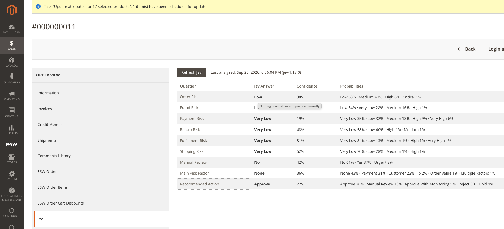
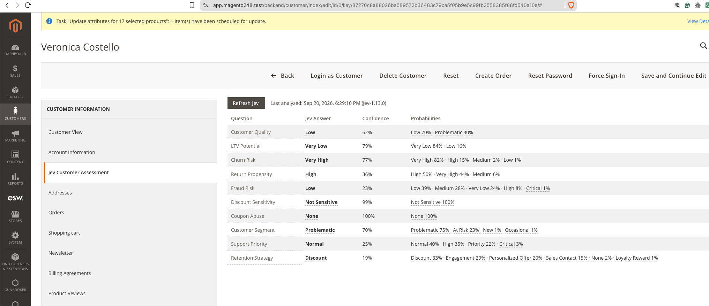
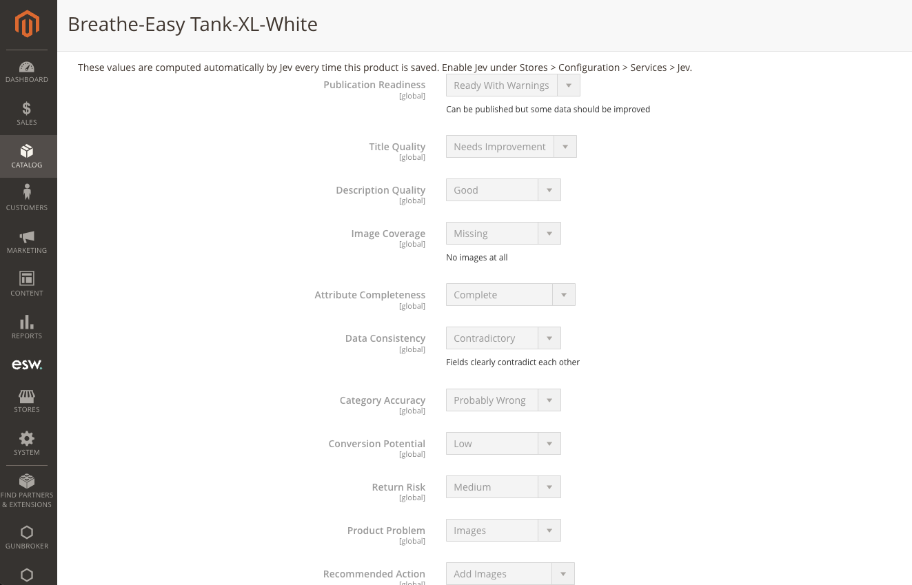
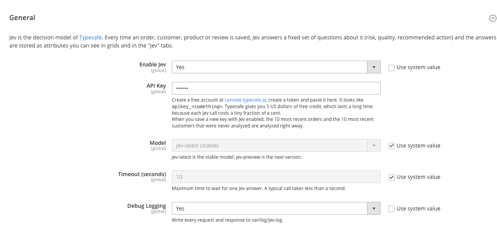
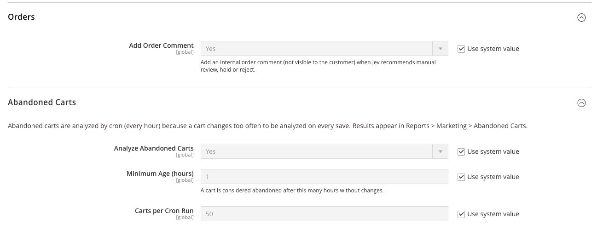
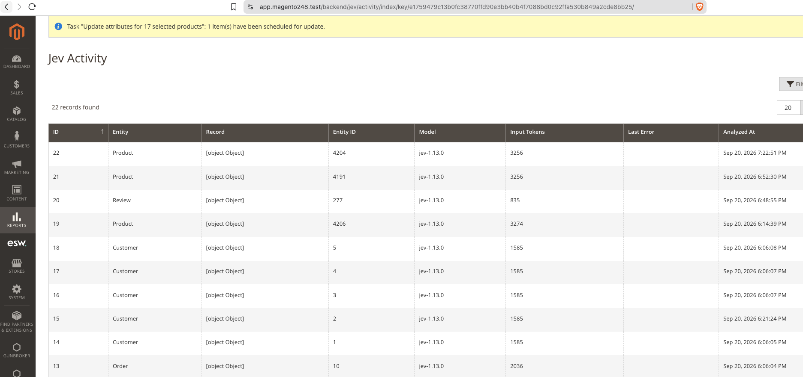

# HenriqueKieckbusch_Jev

Jev is the decision model of [Typesafe](https://typesafe.ai). This module asks Jev a
fixed set of yes/no and multiple-choice questions about your orders, customers,
products, reviews and abandoned carts, and stores every answer directly on the
entity, with its confidence and full probability breakdown. Every question is asked
in a **single API call per entity**, so one order save costs one Typesafe request
no matter how many questions it answers.

## Screenshots

**Order** — new "Jev" tab on the order view page, with a tooltip explaining what the
chosen answer means:



**Customer** — new "Jev Customer Assessment" tab on the customer edit page:



**Product** — dedicated, read-only "Jev" attribute group on the product edit page,
updated automatically every time the product is saved:



**Configuration** — Stores &gt; Configuration &gt; Services &gt; Jev:




**Jev Activity** — every analyzed entity, of every type, in one report (Reports &gt;
Marketing &gt; Jev Activity):



## What Jev answers

| Entity | Where you see it | When it runs |
| --- | --- | --- |
| Order | New "Jev" tab on the order view page, plus optional Sales &gt; Orders grid columns | On every order save (after the order is committed) |
| Customer | New "Jev" tab on the customer edit page, plus optional Customers grid columns | On every customer save (after commit) |
| Product | New "Jev" attribute group on the product edit page (read-only, auto-updated, each field's note shows what its current answer means), plus optional grid columns | On every product save (after commit) |
| Review | Panel below the review edit form, plus two columns on the reviews grid | On every review save (admin and storefront, after commit) |
| Abandoned cart | Columns on Reports &gt; Marketing &gt; Abandoned Carts | Hourly cron, for carts inactive for a configurable number of hours |

All analyzed entities (of every type) are also listed together, with their tokens
used and any error, on **Reports &gt; Marketing &gt; Jev Activity**.

Every question and its allowed answers live in `Model/Question/*Questions.php`, one
class per entity type. Each question becomes one attribute/column named
`jev_<question_code>` (for example `jev_order_risk`), whose default value is empty
until the entity has been analyzed at least once.

The question list here was deliberately narrowed from a larger brainstorm: only
questions Jev can actually answer from the data one entity carries were kept (for
example, "is this a duplicate product?" was dropped, because a single product's
context never includes the rest of the catalog to compare against).

## Requirements

* Magento Open Source / Adobe Commerce 2.4
* PHP 8.1 - 8.4
* A [Typesafe](https://console.typesafe.ai/login) account and API key

## Installation

### Via Composer (recommended)

The module is published at
[github.com/henriquekieckbusch/henriquekieckbusch-module-jev](https://github.com/henriquekieckbusch/henriquekieckbusch-module-jev).
It is not on Packagist, so point Composer at the GitHub repository directly by adding
a `repositories` entry to your Magento project's root `composer.json` (or run the
equivalent `composer config` command below), then require the package as usual:

```bash
composer config repositories.henriquekieckbusch-module-jev vcs git@github.com:henriquekieckbusch/henriquekieckbusch-module-jev.git
composer require henriquekieckbusch/module-jev:^1.0
bin/magento module:enable HenriqueKieckbusch_Jev
bin/magento setup:upgrade
bin/magento cache:flush
```

If your GitHub access is over HTTPS instead of SSH, use that URL instead:

```bash
composer config repositories.henriquekieckbusch-module-jev vcs https://github.com/henriquekieckbusch/henriquekieckbusch-module-jev.git
```

To pull in a new release later:

```bash
composer update henriquekieckbusch/module-jev
bin/magento setup:upgrade
bin/magento cache:flush
```

In Warden, prefix the `bin/magento` commands (not `composer`, which normally runs on
the host) with `warden env exec -T php-fpm`:

```bash
warden env exec -T php-fpm bin/magento module:enable HenriqueKieckbusch_Jev
warden env exec -T php-fpm bin/magento setup:upgrade
warden env exec -T php-fpm bin/magento cache:flush
```

### Manually (without Composer)

Copy or clone this module's contents into
`app/code/HenriqueKieckbusch/Jev` and run the same three commands:

```bash
bin/magento module:enable HenriqueKieckbusch_Jev
bin/magento setup:upgrade
bin/magento cache:flush
```

## Configuration

Go to **Stores &gt; Configuration &gt; Services &gt; Jev**.

* **Enable Jev** — switched off by default.
* **API Key** — create a free account at
  [console.typesafe.ai/login](https://console.typesafe.ai/login), create a token
  and paste it here. It looks like `apikey_<something>`. Typesafe gives new
  accounts 5 US dollars of free credit, which lasts a long time because each Jev
  call costs a tiny fraction of a cent. The key is validated against the API and
  stored encrypted; it is empty by default.
* **Model** — `jev-latest` (default) or `jev-preview`.
* **Timeout** — HTTP timeout per call, in seconds.
* **Debug Logging** — writes every request/response to `var/log/jev.log`.
* **Orders &gt; Add Order Comment** — adds an internal order comment when Jev
  recommends manual review, hold or reject.
* **Abandoned Carts** — enable/disable the hourly analysis, minimum inactivity in
  hours before a cart counts as abandoned, and how many carts are analyzed per run.

**When you save a new API key with Jev enabled**, the 10 most recent orders and the
10 most recent customers that have never been analyzed are analyzed immediately, so
you see results right away instead of waiting for the next save.

## How it works

* **Model, not Helper.** All logic lives under `Model/` (`Analyzer`, `Client`,
  `Config`, `Handler/*`, `Question/*`); this module does not use the deprecated
  `Helper` layer.
* **One handler per entity type** (`Model/Handler/Order.php`,
  `Customer.php`, `Product.php`, `Review.php`, `Quote.php`) builds the JSON context
  sent to Jev and knows how to persist the answers back without triggering another
  save (`ResourceModel::saveAttribute`, `Product\Action::updateAttributes`, or a
  direct SQL `UPDATE`, so there is never a risk of an infinite save loop).
* **`Model/Client.php`** is the only class that talks to `https://api.typesafe.ai`
  (see [docs.typesafe.ai/api](https://docs.typesafe.ai/api)), using
  `Magento\Framework\HTTP\Client\Curl`.
* **`Model/Analyzer.php`** orchestrates one analysis: builds the context, skips the
  API call when the context has not changed since the last analysis (unless
  forced), calls the client, persists the answers and keeps a full record (answers,
  confidence, probabilities, token usage, last error) in the
  `henriquekieckbusch_jev_analysis` table.
* **"Refresh Jev"** links/buttons force a new analysis regardless of whether the
  context changed. You will find one on the order and customer "Jev" tabs, on the
  review panel, on the Abandoned Carts report, and as a mass action on the orders,
  customers and products grids.
* **`bin/magento jev:analyze <type> <id>...`** analyzes any entity from the
  command line, e.g. `bin/magento jev:analyze order 5 6 7`.

## Reading the "Jev" tab / panel

Every "Jev" tab, panel and section shows the short answer code (e.g. "Good",
"Missing", "Manual Review") rather than the full sentence Jev was given, to keep the
table readable. Where a question or an answer has a longer explanation, **hover over
it** to see it as a tooltip:

* Hovering the question name shows the full question sent to Jev.
* Hovering the chosen answer, or any option listed under "Probabilities", shows what
  that specific answer means (when one was written for it — short, self-explanatory
  answers like "low"/"medium"/"high" have no extra tooltip).
* On the product edit page, the same explanation is shown as the field's note, right
  under the dropdown, for the currently saved answer. When that answer has no longer
  description of its own, the note is simply left empty.

## Translations

Every question label, answer option and longer description is wrapped in Magento's
translation function and listed, source phrase by source phrase, in
`i18n/en_US.csv`. The API call itself always sends the question in English to Jev
(translating what is sent to the model would change the analysis), but everything
shown in the admin UI can be translated by adding a `i18n/<locale>.csv` file with the
same source phrases in the first column and the translation in the second, the same
way any other Magento module is translated.

## Adding Jev columns to a grid

Every grid that shows a Jev-covered entity (Sales &gt; Orders, Customers, Products,
Reviews, Abandoned Carts) already ships the columns; open the grid's **Columns**
control and tick the ones you want visible. Most default to hidden except the two
or three most actionable ones, to keep the grid readable out of the box.

## Uninstall

```bash
bin/magento module:disable HenriqueKieckbusch_Jev
bin/magento module:uninstall HenriqueKieckbusch_Jev
```

## Coding standard

This module targets the [Magento Coding Standard](https://github.com/magento/magento-coding-standard)
version 41 (`Magento2` ruleset). Run:

```bash
vendor/bin/phpcs --standard=Magento2 app/code/HenriqueKieckbusch/Jev
```
